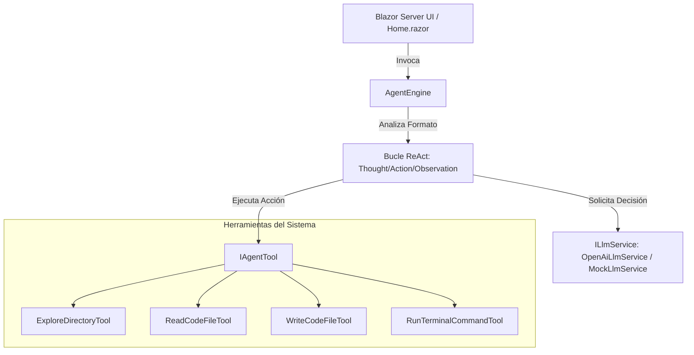

# 🧠 TaskDrivenAgents: Motor de Agente Autónomo ReAct en .NET 10

[](https://dotnet.microsoft.com/)
[](https://mudblazor.com/)
[](LICENSE)

Un potente **Motor de Agente Autónomo** basado en el framework **ReAct (Reasoning and Acting)** construido íntegramente sobre **.NET 10** y **Blazor Server** con una interfaz de usuario premium e interactiva provista por **MudBlazor**. 

Este proyecto demuestra cómo un LLM (como Google Gemini o Llama a través de Groq) puede resolver tareas complejas de desarrollo de software interactuando directamente con el sistema local a través de herramientas especializadas en tiempo real.

---

## 🚀 Características Clave

* **🤖 Ciclo ReAct Autónomo**: Descompone objetivos complejos formulados en lenguaje natural en pasos secuenciales de **Pensamiento (Thought)**, **Acción (Action)** y **Observación (Observation)**.
* **🛠️ Herramientas de Sistema (Tools)**:
  * `ExploreDirectoryTool`: Permite al agente explorar estructuras de directorios.
  * `ReadCodeFileTool`: Permite leer archivos de código fuente.
  * `WriteCodeFileTool`: Habilita al agente para crear o modificar código fuente.
  * `RunTerminalCommandTool`: Ejecuta comandos de terminal local (ej. `dotnet build`, `dotnet test`).
* **💻 Interfaz de Usuario Premium**: Diseñada con **MudBlazor**, cuenta con un terminal interactivo de ejecución en tiempo real, pestañas de logs estructurados y visualización de reportes Markdown renderizados al vuelo.
* **🔌 Soporte Multimodelo Integrado**:
  * **Google Gemini** (1.5 Flash, 2.5 Flash, 2.5 Pro) vía OpenAI compatibility API.
  * **Llama 3.3 & DeepSeek R1** vía Groq Cloud API.
* **🔒 Arquitectura Segura**: Gestión de credenciales mediante configuración dinámica local (`appsettings.local.json`), previniendo la exposición accidental de API Keys en el repositorio de Git.

---

## 🏗️ Arquitectura del Proyecto

El proyecto está diseñado bajo una arquitectura modular limpia para garantizar la mantenibilidad y extensibilidad:



### Estructura de Módulos
* **`Core/`**: Lógica central del motor del agente (`AgentEngine`) y definiciones de modelos de ejecución.
* **`Services/`**: Servicios de comunicación con proveedores de Modelos de Lenguaje (LLMs).
* **`Tools/`**: Implementaciones concretas de herramientas de lectura, escritura, exploración y ejecución en la terminal.
* **`Components/`**: Interfaz de usuario interactiva y layouts en Blazor.

---

## 🛠️ Configuración y Ejecución

### Prerrequisitos
* [.NET 10 SDK](https://dotnet.microsoft.com/download/dotnet/10.0) instalado.

### Instalación
1. Clona el repositorio:
   ```bash
   git clone https://github.com/lucasludu/TaskDrivenAgents.git
   cd TaskDrivenAgents
   ```

2. Configura tus credenciales. Crea el archivo `appsettings.local.json` en la raíz del proyecto para almacenar tus llaves de API de forma segura localmente (este archivo está preconfigurado en `.gitignore`):
   ```json
   {
     "OPENAI_API_KEY": "TU_GEMINI_API_KEY",
     "GROQ_API_KEY": "TU_GROQ_API_KEY"
   }
   ```
   *Nota: Si prefieres usar variables de entorno, el motor también buscará automáticamente `OPENAI_API_KEY` y `GROQ_API_KEY` en tu sistema.*

### Ejecutar Localmente
Para iniciar el servidor de desarrollo, ejecuta:
```bash
dotnet run
```
Abre tu navegador en `http://localhost:5000` (o la dirección que te indique la terminal) para ver la interfaz interactiva.

---

## 📈 Demostración de Uso

1. **Establecer el Workspace**: Introduce el directorio local en el cual deseas que el agente trabaje.
2. **Definir el Objetivo**: Introduce una tarea compleja en lenguaje natural. Ejemplos de uso provistos en la app:
   * *“Explorá el directorio actual, encontrá el archivo 'Program.cs' y explicame qué servicios se están inyectando en él. Guardá el resultado en un archivo 'explicacion.md'.”*
   * *“Ejecutá 'dotnet build' en la terminal. Si hay errores, decime cuáles son. Si compila bien, decime 'Todo OK' y guardá el log de consola en 'build_log.md'.”*
3. **Ejecutar e Interactuar**: Presiona **"Iniciar Agente"** y observa cómo razona y realiza acciones paso a paso.

---

## ⚙️ Tecnologías Utilizadas

* **C# 13 & .NET 10**
* **Blazor Server** (con RenderMode Interactivo)
* **MudBlazor** (Componentes UI Modernos y Premium)
* **Markdown (Markdig)** (Para el renderizado dinámico de reportes en pantalla)
* **REST APIs** (Integración fluida con OpenAI compatible API y Groq API)

---

## 📝 Licencia
Este proyecto está bajo la Licencia MIT. Consúltala para más detalles.
